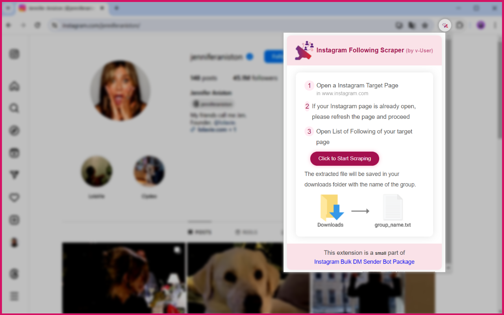
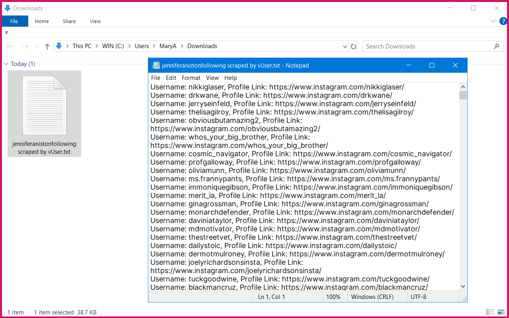

# Instagram Following Scraper Chrome Extension

## Overview

This Chrome extension scrapes following from a target Instagram page. Simply open the following list, click the scrape button, and the extension will gather usernames and profile links, saving them in a `.txt` file in your download folder.

### Features
*   **Scrapes Instagram following usernames and profile links**
*   **Saves data in a `.txt` file**
*   **Easy one-click scraping process**
*   **Provides progress notifications**

### How to Use
1. Install the extension in Chrome.
2. Go to the Instagram page you want to scrape.
3. Open the following list.
4. Click the scrape button in the extension.
5. Wait for the process to finish.
6. Find the data in your download folder.

### Installation
1. Download the extension from [MehDAsaD/instagram-following-scraper-chrome-extension](https://github.com/MehDAsaD/instagram-following-scraper-chrome-extension/tree/main).
2. Open Chrome and go to "[chrome://extensions/](chrome://extensions/)".
3. Enable "Developer mode".
4. Click "Load unpacked" and select the extension folder.

### Technical Details
- Utilizes JavaScript for web scraping.
- Provides real-time notifications.
- Automatically scrolls to load all following.
- Saves data as a text file.
  

## Screenshots
1. Click on the Instagram Following Extractor extension icon to view the user interface in a pop-up. Click the "Click to Start Scraping" button to begin extraction.

   

2. You will see that the following are being extracted.

   

3. The following information is automatically saved in the Downloads folder on your system.

   

### Product Link

This extension is part of the Virtual User Instagram Follower Booster Bot Package. For more information about this package, please visit [the product page on the Virtual User website.](https://www.v-user.com/en/side-products/instagram-robot)

#InstagramScraper #ChromeExtension #DataExtraction #WebScraping #JavaScript #InstagramFollowingScraperChromeExtension #InstagramFollowingScraperExtension #FollowingScraper
